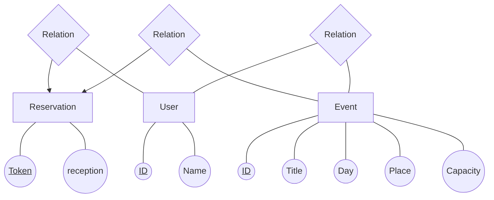

```mermaid
graph TB;

rel1{Relation};
rel2{Relation};
rel3{Relation};

user[User];
id((<u>ID</u>));
name((Name));

reservation[Reservation];
token((<u>Token</u>));
reception((reception));

event[Event];
eventID((<u>ID</u>));
title((Title));
day((Day));
detail((Place));
capacity((Capacity));

user --- id
user --- name

reservation --- token
reservation --- reception

event --- eventID
event --- title
event --- day
event --- detail
event --- capacity

rel1 --> reservation
rel1 --- user

rel2 --> reservation
rel2 --- event

rel3 --- user
rel3 --- event

```
