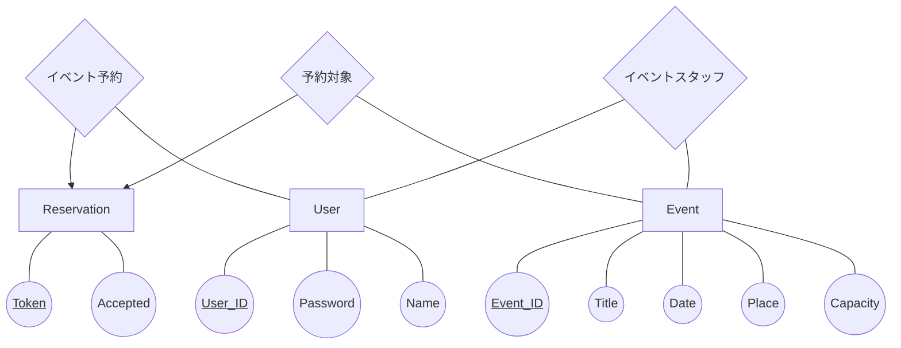

```mermaid
graph TB;

rel1{イベント予約};
rel2{予約対象};
rel3{イベントスタッフ};

user[User];
id((<u>User_ID</u>));
password((Password));;
name((Name));

reservation[Reservation];
token((<u>Token</u>));
accepted((Accepted));

event[Event];
eventID((<u>Event_ID</u>));
title((Title));
date((Date));
detail((Place));
capacity((Capacity));

user --- id
user --- password
user --- name

reservation --- token
reservation --- accepted

event --- eventID
event --- title
event --- date
event --- detail
event --- capacity

rel1 --> reservation
rel1 --- user

rel2 --> reservation
rel2 --- event

rel3 --- user
rel3 --- event

```
